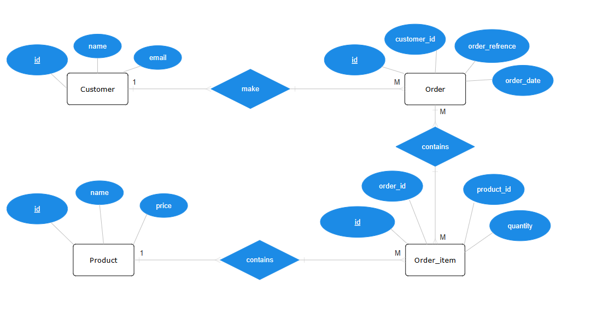

# Chamath Assignment

## 📌 Project Setup

Follow these steps to set up and run the project.

### Clone the Repository

```sh
git clone https://github.com/chamadev99/chamath-assignment.git
cd your-repository
```

### Install Dependencies

Run the following command to install required dependencies:

```sh
composer install
```

### Configure the Environment

Copy the `.env.example` file to `.env` and update your database credentials:

```sh
cp .env.example .env
```

Then generate the application key:

```sh
php artisan key:generate
```

### Run Migrations

Run the database migrations to create the necessary tables:

```sh
php artisan migrate
```

### Start Queue Worker

If your project uses jobs and queues, start the queue worker:

```sh
php artisan queue:work
```

### Run the Application

Start the development server:

```sh
php artisan serve
```

The project will be available at:  
**http://127.0.0.1:8000**

---

## **🧪 API Documentation**

#### **Link:**

```http
route /api/documentation
```

---

## Api Endpoints

```sh
-http://chamath-assignment.test/api/upload-document
-http://chamath-assignment.test/api/generate-document
-http://chamath-assignment.test/api/download-document/{pdf_name.extention}
```

---

## Running Tests

To run the test cases, use the following command:

```sh
php artisan test
```

### Test Cases

#### ** `test_upload_validation()`**

test file upload validation .

#### ** `test_upload_file()`**

test CSV file upload and checks for a **200 OK** response.

#### ** `test_return_order_data()`**

Creates mock customer, product, order, and order items using factories.  
 Retrieves order data and logs it in `storage/logs/laravel.log`.  
 Asserts that the data is **not empty**.

---

## **Useful Commands**

| Task               | Command                  |
| ------------------ | ------------------------ |
| Run migrations     | `php artisan migrate`    |
| Start queue worker | `php artisan queue:work` |
| Run tests          | `php artisan test`       |
| Serve the project  | `php artisan serve`      |

---


